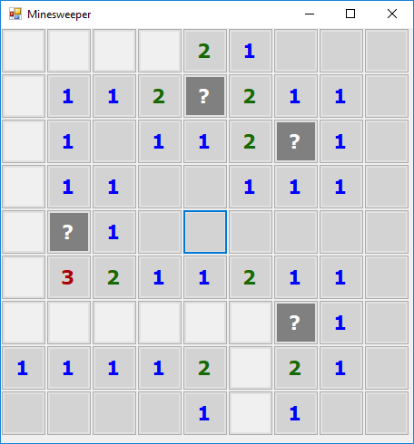
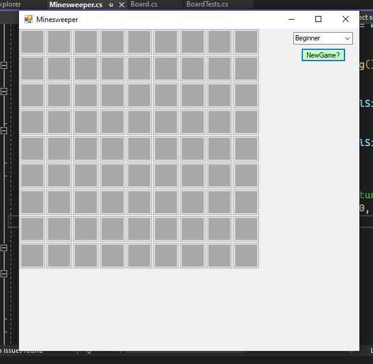
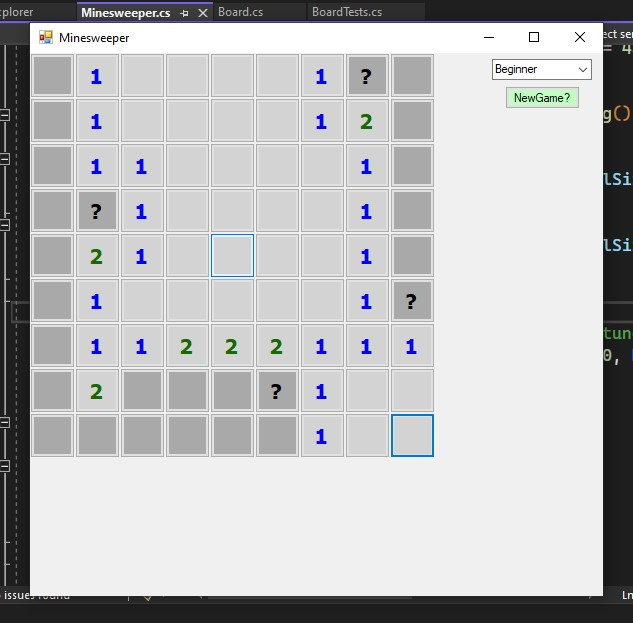
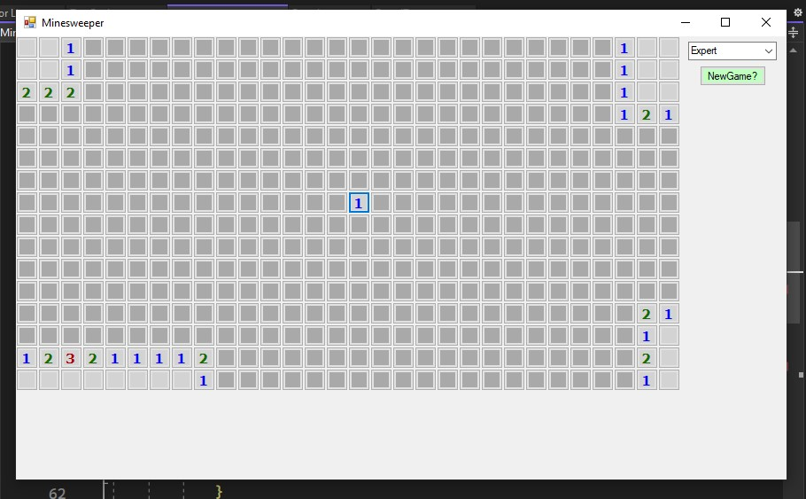
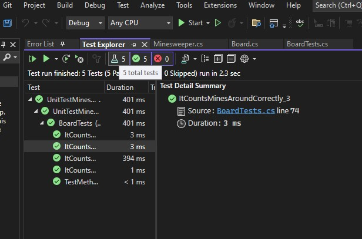

# Minesweeper

Create a classic minesweeper game, you are given some starting point already.



## Requirements

You are presented with a board of squares. Some squares contain mines (bombs), others don't. If you click on a square containing a bomb, you lose. If you manage to click all the squares (without clicking on any bombs) you win.
Clicking a square which doesn't have a bomb reveals the number of neighbouring squares containing bombs. Use this information plus some guess work to avoid the bombs.
To open a square, point at the square and click on it. To mark a square you think is a bomb, point and right-click.

- A squares "neighbours" are the squares adjacent above, below, left, right, and all 4 diagonals. Squares on the sides of the board or in a corner have fewer neighbors. The board does not wrap around the edges.
- If you open a square with 0 neighboring bombs, all its neighbors will automatically open. This can cause a large area to automatically open.
  To remove a bomb marker from a square, point at it and right-click again.
- The first square you open is never a bomb.
- If you mark a bomb incorrectly, you will have to correct the mistake before you can win. Incorrect bomb marking doesn't kill you, but it can lead to mistakes which do.
- You don't have to mark all the bombs to win; you just need to open all non-bomb squares.

### Results

Begginer "New Game"



Begginer "Few Clicks"



Expert "Few Clicks"



You will have to download and test the "Intermediate" :P

Feel free to run tests or write your own. I am testing function that adds number that represents how many mines are around it.

```
[3,*,2,0],
[*,*,3,1],
[2,3,3,*],
[0,1,*,2]
```

Here in 2D list above, we can see that there are 5 mines and NumMines number are from 0 to 3.


